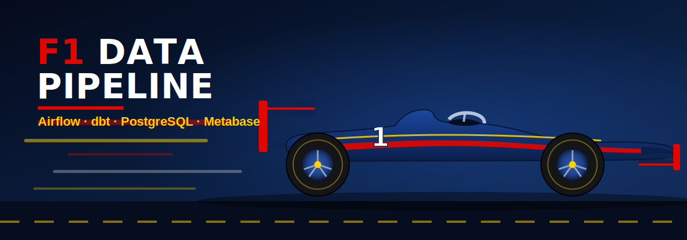
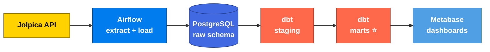
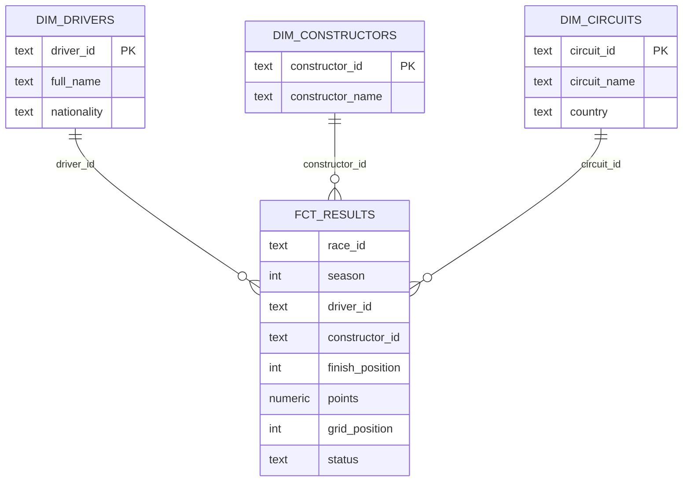

<div align="center">



<br/>

**An end-to-end ELT pipeline that ingests Formula 1 data, models it into a tested star schema, and serves it to interactive dashboards.**

<br/>


</div>

---

## 🏁 Overview

This project pulls Formula 1 race data from a public API, lands it raw in PostgreSQL, transforms it with **dbt** into a clean dimensional model, and exposes it through **Metabase** dashboards — all orchestrated by **Apache Airflow** and running in **Docker**. Loads are idempotent, historical seasons can be backfilled on demand, and data quality is enforced by an orchestrated test gate so bad data never reaches the dashboards.

## 🗺️ Architecture



Airflow sits **above** the pipeline as the conductor: one DAG run performs `extract → stage → test → mart` in dependency order. Metabase reads the finished marts.

## ⭐ Data model

A classic star schema — one central fact surrounded by descriptive dimensions.



## ✨ Features

- **Idempotent ingestion** — paginated, rate-limited API pulls with retry/backoff; re-runs never duplicate data.
- **Historical backfill** — parametrised Airflow runs load multiple past seasons (2020–2024) on demand.
- **Layered dbt models** — nested JSON is flattened into clean staging views, then built into dimensional marts as tables.
- **Data quality gate** — 20+ dbt tests (uniqueness, referential integrity, custom business rules) run *before* marts rebuild; if a test fails, the serving layer keeps the last good data.
- **Self-documenting** — `dbt docs` generates a full column catalogue and lineage graph from `raw` to `fct_results`.
- **Live dashboards** — Metabase reads the marts directly: champions by season, wins by constructor, driver head-to-heads.

## 🧱 Tech stack

| Layer | Tool |
|---|---|
| Containerisation | Docker Compose |
| Orchestration | Apache Airflow (LocalExecutor) |
| Storage / warehouse | PostgreSQL 16 |
| Transformation | dbt Core (Postgres adapter) |
| BI / dashboards | Metabase |
| Source data | [Jolpica F1 API](https://github.com/jolpica/jolpica-f1) (Ergast successor) |

## 🚀 Quick start

```bash
# 1. build images and initialise Airflow's metadata db
docker compose build
docker compose up airflow-init

# 2. start the stack
docker compose up -d

# 3. open the UIs
#    Airflow  → http://localhost:8081   (admin / admin)
#    Metabase → http://localhost:3000
```

Run the pipeline for the current season, or backfill history one season at a time:

```bash
# single run
docker compose exec airflow-scheduler airflow dags trigger f1_ingest

# backfill a specific season (season is read from the run date)
docker compose exec airflow-scheduler airflow dags trigger f1_ingest \
  --logical-date 2021-01-01T00:00:00+00:00
```

## 📂 Project structure

```
f1-data-pipeline/
├── docker-compose.yml        # postgres · airflow · dbt · metabase
├── Dockerfile.airflow        # airflow image + isolated dbt venv
├── Dockerfile.dbt            # standalone dbt image
├── dags/                     # Airflow DAG (extract → dbt gate)
├── include/                  # extraction + load helpers
├── scripts/                  # warehouse init SQL
├── dbt/f1_pipeline/
│   ├── models/staging/       # one clean model per source
│   ├── models/marts/         # dim_* and fct_results
│   └── tests/                # custom business-rule tests
└── assets/                   # banner artwork
```

## 🎯 What it demonstrates

Idempotent API ingestion, dbt modelling and testing, dimensional (star-schema) design, orchestration with quality gates, historical backfilling, and BI on top of a governed warehouse — the core of a modern analytics-engineering stack.

---

<div align="center">
<sub>Data courtesy of the <a href="https://github.com/jolpica/jolpica-f1">Jolpica F1 API</a>. Banner is original artwork — not affiliated with or endorsed by Formula 1, the FIA, or any team.</sub>
</div>
